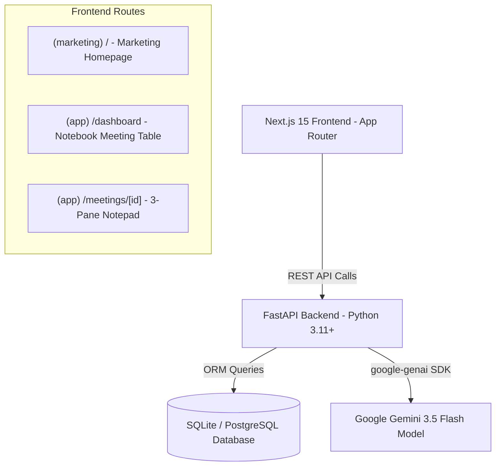

# Fireflies.ai Clone — Master Implementation Plan

This document outlines the full technical architecture, implementation roadmap, and component design for the **Fireflies.ai Clone**.

---

## 🏗️ Architecture Overview



### Stack Breakdown
- **Frontend**: Next.js 15 (App Router), React 19, TypeScript, Tailwind CSS, Heroicons, Date-fns.
- **Backend**: FastAPI, SQLAlchemy ORM, Pydantic v2, Uvicorn, Python-dotenv.
- **AI Engine**: Google GenAI SDK (`gemini-3.5-flash`).
- **Database**: SQLite (local development) / PostgreSQL (production ready).

---

## 🗺️ Master Implementation Roadmap

### Phase 1: Foundation & Backend Core (Completed ✅)
- **Step 1: Scaffolding & Setup**
  - Set up FastAPI project structure & Next.js App Router structure.
  - CORS configuration & basic health-check endpoint (`GET /`).
- **Step 2: Data Layer & Persistence**
  - SQLAlchemy models: `Meeting`, `Participant`, `TranscriptSegment`, `Summary`, `KeyTopic`, `ActionItem`.
  - Database migrations & seeding script (`seed.py`).
- **Step 3: Core API Services**
  - CRUD endpoints for `/meetings` and `/action-items`.
  - Transcript parser supporting `.txt`, `.vtt`, and `.json` formats.
  - Global transcript search endpoint `/meetings/search?q=...`.

### Phase 2: AI Integration & Public Marketing (Completed ✅)
- **Step 4: Public Marketing Homepage**
  - Created `(marketing)` route group with hero section, animated dashboard mockup, feature highlights, social proof, and pricing cards.
- **Step 4.1: Dashboard "Notebook" Overhaul**
  - Created `(app)` route group with sticky Navbar and left Sidebar.
  - Built Notebook meeting table displaying meeting title, date, duration, participants, and action items.
  - Created `NewMeetingModal.tsx` for file upload & text paste.
- **Gemini API Integration**
  - Integrated `gemini-3.5-flash` model for generating summaries, key topics, and action items from transcripts.

### Phase 3: Meeting Notepad & Global Search (Completed ✅)
- **Step 5: 3-Pane Notepad Interface**
  - `MediaPlayer.tsx`: Seekable player with animated audio visualizer & speed control.
  - `TranscriptPanel.tsx`: Auto-scrolling speaker thread synced with player timestamp.
  - `AISidebar.tsx`: Tabbed sidebar for AskFred summary, action item toggles, and key topic outline.
- **Global Transcript Search**
  - Implemented live debounced global search in `Navbar.tsx`.
  - Auto-plays and seeks media player on match selection (`?t=[seconds]`).

---

## 🚀 Remaining Implementation Plan (Phase 4 & 5)

### Step 6: Meeting CRUD & Management Modals
- [ ] **EditMeetingModal.tsx**: Allow editing meeting title, date, and participants.
- [ ] **ConfirmDeleteModal.tsx**: Confirmation modal to safely delete meetings.
- [ ] **API Wireup**: Connect `PATCH /meetings/{id}` and `DELETE /meetings/{id}` to frontend UI.

### Step 7: UI Polish & Dark Mode
- [ ] **Dark Mode Toggle**: Implement Tailwind `dark:` mode context provider and toggle button in `Navbar.tsx` or `Sidebar.tsx`.
- [ ] **Visual Micro-animations**: Add smooth tab transitions, hover glassmorphism, and loading skeleton states.

### Step 8: Bonus Productivity Features
- [ ] **Export Options**: Allow users to download transcripts or AI summaries as `.md` or `.txt` files directly from the Notepad.
- [ ] **Meeting Tags & Filters**: Category tags (e.g., *Sales*, *Engineering*, *Marketing*) with filter pills on the Notebook dashboard.

### Step 9: Documentation
- [ ] Write a complete `README.md` with setup commands, environment variable configuration, and architecture overview.

### Step 10: Production Deployment
- [ ] Configure `vercel.json` for frontend deployment.
- [ ] Configure Dockerfile / Render / Railway blueprint for backend deployment.

---

## 🛠️ Data Model Reference

```typescript
interface MeetingDetail {
  id: number;
  title: string;
  date: string;
  duration_seconds: number;
  media_url: string | null;
  participants: Participant[];
  transcript_segments: TranscriptSegment[];
  summary: Summary | null;
  key_topics: KeyTopic[];
  action_items: ActionItem[];
}
```
